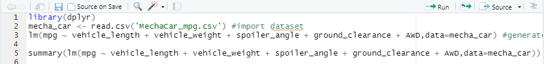
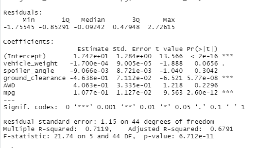
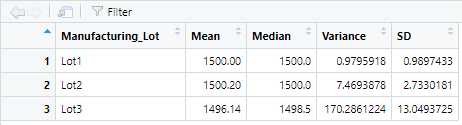
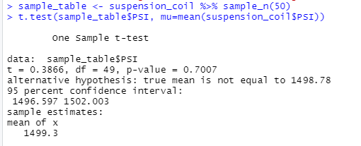
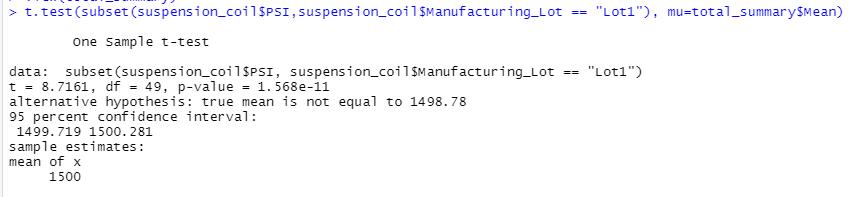
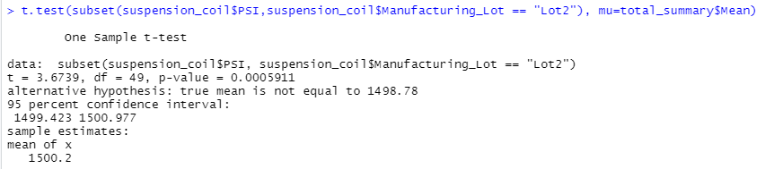
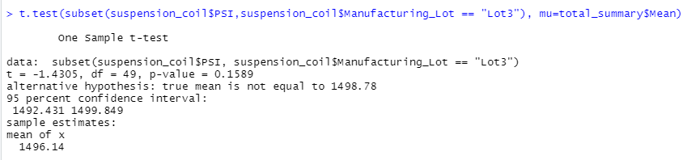

# MechaCar_Statistical_Analysis

## Linear Regression to Predict MPG
For the first statistical analysis we performed a linear regression model to predict the mpg of MechaCar prototypes using multiple variables. This statistical analysis is a multi linear regression model. We used the lm() function in R to to perform a linear regression model and then used the summary function to get the p value and R squared value.

The p value was 5.35e-11 which is less than our 0.05 goal. Therefore we can reject the null hypothesis that the slope is 0, and state there is correlation. The squared metric is 0.71 which shows 71% accuracy for the model.

**Which variables/coefficients provided a non-random amount of variance to the mpg values in the dataset?**

The variables/coefficients that were non random are intercept, vechicle length, and ground clearance. These values/coefficients were all smaller than a 0.05 p value and therefore are unlikely to provide random amounts of variance in the model. Furthermore if the intercept is non random this usually means there are other data metrics and variables that contribute to variance that are not included in this model. 

**Is the slope of the linear model considered to be zero? Why or why not?**

The slope is not 0. The null hypotheses is to assume the slope is 0.  Since our p value is 5.35e-11 which is less than 0.05, we can say this is not statistically significant and reject the null hypothesis that the slope is 0. 

**Does this linear model predict mpg of MechaCar prototypes effectively? Why or why not?**

Yes this linear model does predict the mpg of MechaCar prototypes effectively. This model had a R squared score of 0.71 which states 71% accruarcy. 

 
## Summary Statistics on Suspension Coils

For the second statistical analysis we transformed the dataset to look at the total summary using the summarize() function to get statistical measurements of the total as well as by Lot. First using the summarize function we took the dataframe and the column for PSI to get statistical measures for dataframe including mean, median, variance, and standard deviation. My data came out a bit differently from the example but the class consensus was that these numbers below were correct.  Here we can see the mean of the dataframe is 1499 and the variance is 62. 

Next we wrote an RScript using group_by and summarize() to group each manufacturing lot by mean, median, variance, and standard deviation. Here we can the statistical measures by each lot. 

**The design specifications for the MechaCar suspension coils dictate that the variance of the suspension coils must not exceed 100 pounds per square inch. Does the current manufacturing data meet this design specification for all manufacturing lots in total and each lot individually? Why or why not?**

The total meeets the design specifications since the total variance is 62 and the limit is 100.  Lots 1 and 2 also both meet this requirement with 0.92 and 7.46 variances which are both below 100. The 3rd lot does not meet design specifications since its variance is 170 which is over 100.

## T-Tests on Suspension Coils
For our third statistical analysis we performed t-tests to determine if all manufacturing lots and each lot individually are statistically different from the population mean of 1500 pounds per square inch. First we used the t.test() function to find out if PSI across all 3 manufacturing lots are statistically different from the population mean of 1500. Here we took a sample of the data to compare. Comparing the mean of the sample data to the mean of the population data we see that the p-value = 0.7007. This is higher than our p value of 0.05.  This means that we can't reject the hypothesis that there is no statistical difference and therfore the sample and population data are statistically similar. 

Next we took a look to see if our Lot 1 and our population data are statistically similar using the subset() function in R.  Here the p value = 2.2e-16 which is smaller than our value set at 0.95. We can reject the null hypothesis that there is no statistical difference. Lot 1 and the population data are statistically different.

Then we did the same analysis but with Lot 2. Here the p value was 0.0005911 which is also smaller than our value set at 0.05. This means we reject our null hypothesis that there is no statistical difference. Lot 2 and the population data are statistically different. 

Lastly, we performed the analysis on Lot 3. Here the p value was 0.1589. This is larger than our p-value set at 0.05. This means we can not reject our null hypothesis that there is no statistical difference. Lot 3 and the population data are statistically similar. 

## Study Design: MechaCar vs Competition

In this statistical study I would compare car sale prices by model/year for Mecha vs their largest competitor to see how competitive their pricing is to their competitor. 

**What metric or metrics are you going to test?**

We would look at the cost price metric for each car sold at Mecha and it's competitor. Then we would calculate the mean (sale price) per car model/year for Mecha and for it's competitor.

**What is the null hypothesis or alternative hypothesis?**

The null hypothesis is that the cost per car model/year is not higher than competitors. The alternative hypothesis is that the cost per model is higher than competitors.

**What statistical test would you use to test the hypothesis? And why?**

I'd use a paired t test for this test so we could compare two different data sets(Mecha & competitor) between each paired observation (mean cost per model/year). 

**What data is needed to run the statistical test?**

We would need the car sales data (cost, model, year) from both MechaCar and their competitor. 

Another analysis I would perform would be to look at correlation between safety and costs. I'd use the linear regression model to see if a more expensive car means a higher safety rating. We would use safety rating and cost per car for our metrics. The null hypothesis would be that the slope is 0 and there is no correlation. We would the cost and safety rating of each car for data.
